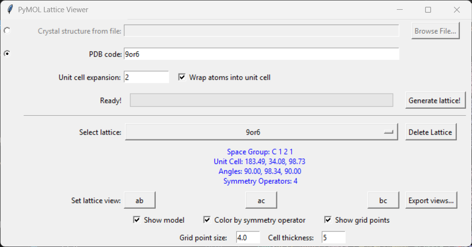
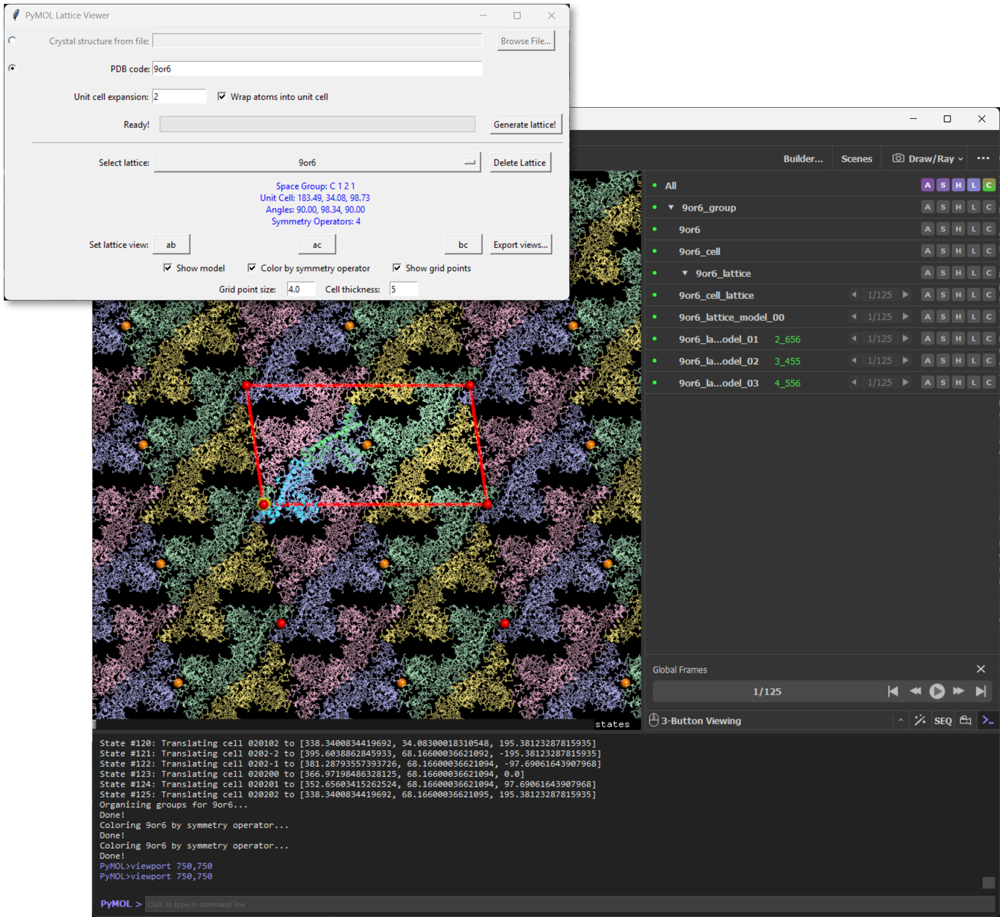
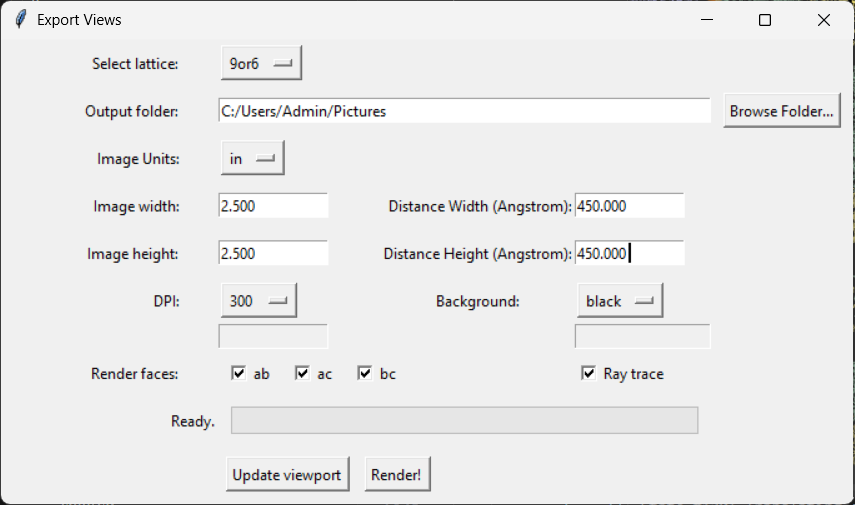

Lattice Explorer is a plugin for generating and visualizing crystal lattices directly within PyMOL. It automates the generation of symmetry mates and allows for easy exploration of crystal packing, unit cell boundaries, and lattice interactions. It is particularly useful for visually comparing different crystal lattices and generating high-quality, consistent figures for publication.

---
## Prerequisites
- [PyMOL v2.0+](https://pymol.org/)

---
## Basic Usage

1. Download [`lattice_explorer.py`](lattice_explorer.py).
2. Open PyMOL.
3. `File` > `Run Script...` and select `lattice_explorer.py`.
4. The Lattice Explorer window should open automatically.
   
   

5. **Input:**
    * **Crystal structure from file:** Browse for a local PDB/CIF file.
    * **PDB code:** Enter a 4-character PDB code to fetch from the RCSB.
6. **Parameters:**
    * **Unit cell expansion:** Number of unit cells to expand in each direction (e.g., 1 creates a 3x3x3 block).
    * **Wrap atoms:** Moves atoms that are outside the unit cell box back into it (based on fractional coordinates).
7. Click **Generate lattice!**
    * The script will generate the unit cell and symmetry mates.
    * Progress is shown in the status bar.

---
## Visualization & Management

Once the lattice is generated, you can control the visualization:

* **Select lattice:** Choose which loaded model to control.
* **Delete Lattice:** Removes all generated lattice and cell objects for the selected model.
* **Set lattice view:** Quickly align the view to the `ab`, `ac`, or `bc` faces of the unit cell.
* **Color by symmetry operator:** Colors each ASU symmetry mate according to its symmetry operator.
* **Show grid points:** Toggles spheres at the unit cell vertices.
* **Grid point size / Cell thickness:** Fine-tune the visual representation of the unit cell boundaries.

### Exporting Views
Click **Export views...** to open the advanced export dialog. The tool remembers your last used directory and DPI settings for a faster workflow.

1. **Output folder:** Select where to save your images.
2. **Dimensions & Units:** Set the image size in `px`, `in`, or `cm`.
3. **DPI:** Choose a standard resolution or select **custom...** to input your own.
4. **Background:** Choose white, black, or **custom...** (supports color names or packed RGB hex values like `0xffffff`).
5. **Render faces:** Select which unit cell faces (`ab`, `ac`, `bc`) to batch render.
6. **Distance Width/Height:** Define the physical span in Angstroms for consistent scaling across different structures.
7. **Ray trace:** Toggle high-quality ray tracing for the final output.
8. Click **Render!** to generate the PNG images.

---
## Example Outputs

### 6A27

### 6A28

### 6A29

### 6BDU

### 6MC6

### 6MC8

### 6NEO

### 6O5L

### 9OM8

### 9OR6

### 9Y6E

### 9YI3

### 9YL4

### 9YUP

---
## Credits

Lattice Explorer was developed to facilitate the analysis of crystal packing interfaces.

[Lattice Explorer](lattice_explorer.py) was written by Robert Szabla of the [Junop Lab](https://junoplab.wordpress.com/) at Western Univerity. 

[PyMOL](https://pymol.org/) is maintained and distributed by Schrödinger.

---
## License
Lattice Explorer is licensed under the GNU General Public License V3.0.
